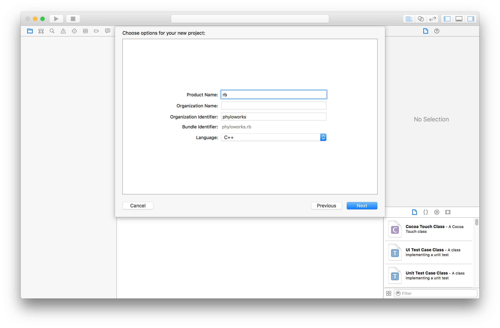
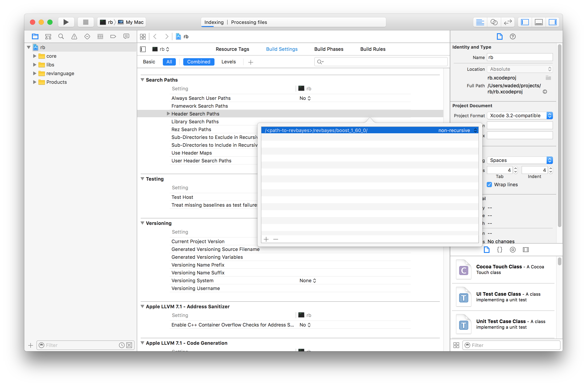
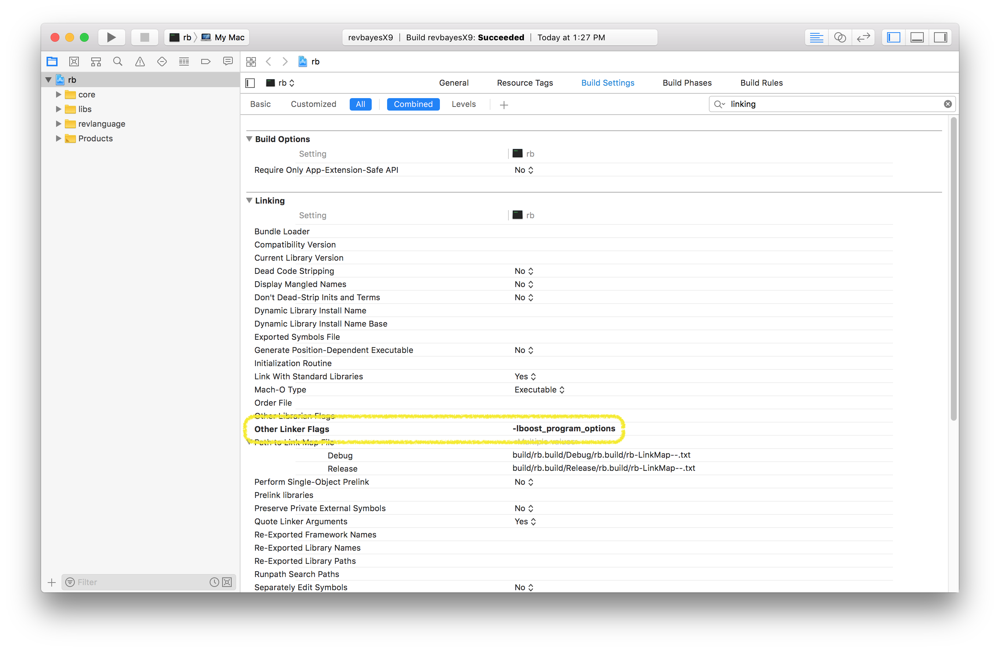
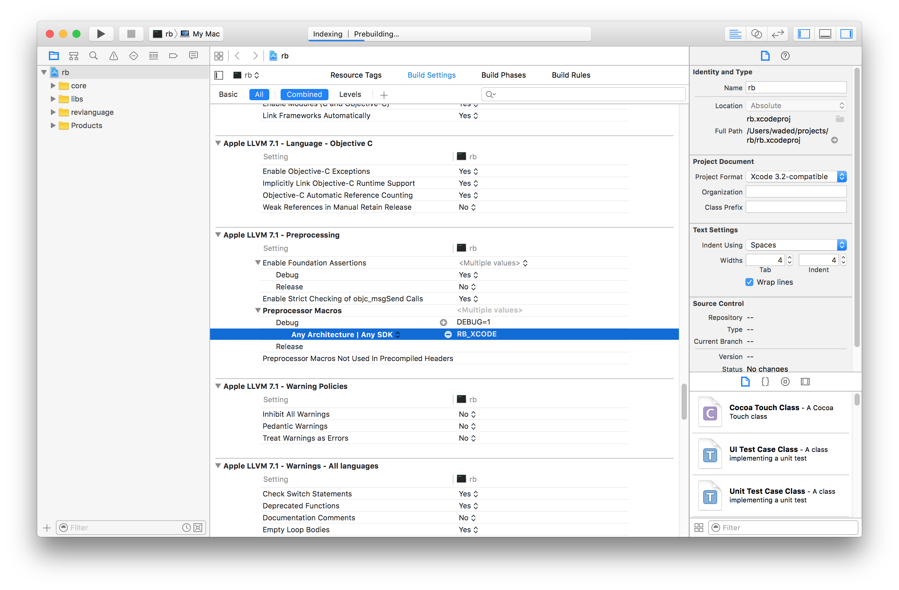
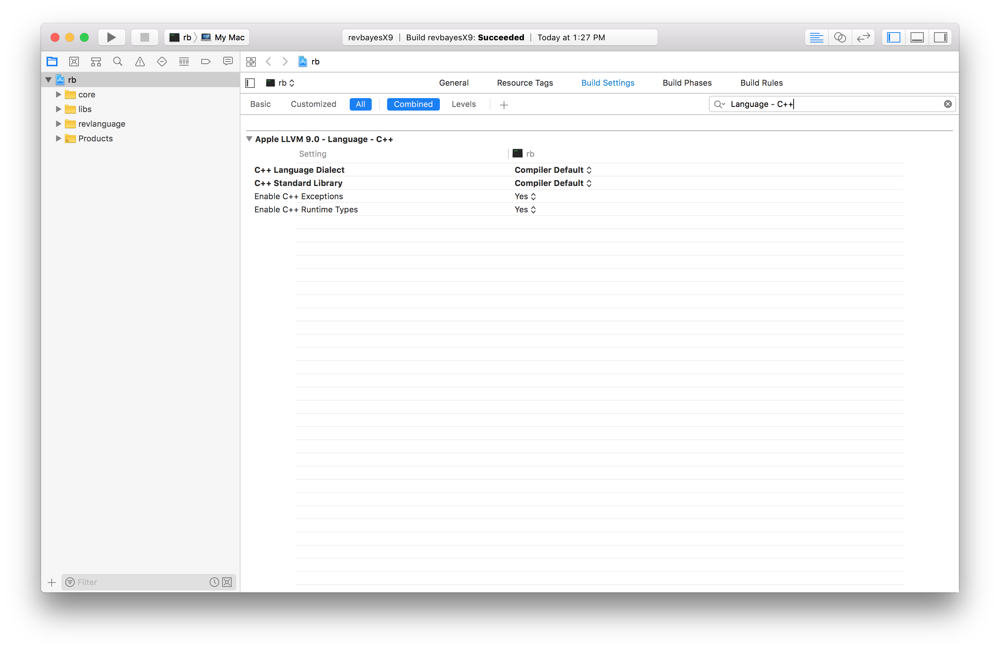

 XCode is an IDE for Mac OSX. XCode does not keep track of files, so each time you open your RevBayes project in Xcode you must pull the RevBayes master branch from git & remove reference to all of the source. Eclipse Oxygen does a cleaner job of managing the files; you do not need to pull from git each time you work in it. 

Set up the XCode Project with an internal build system
------------------------------------------------------

1. Open Xcode and in the *Welcome to Xcode* window, choose **Create a new Xcode project**.
2. Select **Command Line Tool** and name it `rb` and click **Next**. 
3. Click **New Folder**  to create an empty directory and name it whatever you'd like.
4. Click **Create**.
5. Delete all of the files and folders in each of the directories including `main.cpp` so that RevBayes is empty. You can do this by selecting the folders and files, right clicking and selecting delete. When asked, choose **Move to Trash**. 
6. Add the source files by selecting the appropriate directory and going to the **File** pull-down menu and selecting **Add Files to rb**.
7. Click on **Options** at the button of the window, and under the ***Added Folders*** heading, select the **Create Groups** radio button.
    * Select the 
        * `revbayes/src/revlanguage`
        * `revbayes/src/core`
        * `revbayes/src/libs`
    * directories and click **Add**.

    * _Note:_ On some versions of XCode, you may need to click on the "Options" Tab, and choose "Create Groups" for the import to work properly. This is the default behavior on most XCode installs.
8. Add the boost library to your Xcode project - There are currently two options for doing this:
    1. Using the boost library packaged with RevBayes
        * Select the RevBayes project and go to the **Build Settings**. 
        * Search for or Scroll down to the **Search Paths** heading and find the sub-heading named **Header Search Paths**.
            * Double click the heading, click the **+**, and add the value: `<path to revbayes repository>/revbayes/boost_1_60_0`. 
            * where `<path to revbayes repository>` = the location of the revbayes repository on your machine.
        * Now do the same for the **Library Search Paths**, but make sure that you add the path to the lib directory in boost `<path to revbayes repository>/revbayes/boost_1_60_0/stage/lib`
        
    2. Using the boost library from Homebrew (or alternative install)
        * You can install boost from another source and point your Xcode project to that version. It is likely that this will be the way RevBayes will use boost in the near future. If you use Homebrew as a package management system on your Mac, you can install boost using `brew install boost`. This will install the boost libraries in your `/usr/local` directory. To enable this version in your Xcode project, simply change these search paths:
            * **Header Search Paths**: `/usr/local/include`
            * **Library Search Paths**: `/usr/local/lib`
9. Add the boost linker flag
    * Scroll to the **Linking** section in the **Build Settings**
    * Go to **Other Linker Flags** and double click on the space. This will bring up a box where you can add the flag `-lboost_program_options`. 

### Add the `RB_XCODE` Preprocessor Macro to your Xcode project 

1. Select the RevBayes project and go to the **Build Settings**. 
2. Search for or Scroll down to the **Apple LLVM X.X - Preprocessing** heading and find the sub-heading named **Preprocessor Macros**. 
3. Double click on right hand column, click on the **+** and enter `RB_XCODE`. Do not replace the debug flag that is already present.

    
### Check C++ language options

1. Select the RevBayes project and go to the **Build Settings**. 
2. Search or scroll to: **Apple LLVM X.X - C++ - Language **.
3. Make sure C++ Language Dialect is set to ***Compiler Default***.
4. Make sure C++ Standard Library is set to ***Compiler Default***
5. If you get compile errors with these settings, you might want to change these to:
    * Make sure C++ Language Dialect is set to ***Gnu++ 98***.
    * C++ Standard Library is set to ***libstdc++(Gnu C++)***

At this point, if everything has been setup correctly, you should be able to build the project. You can try by clicking on **Product - Build** or by using **&#8984;+B**.

Set up the XCode Project with an external build system
------------------------------------------------------

### Prerequisites

* To compile RevBayes using Xcode, first install [https://cmake.org/](CMake) and its [https://stackoverflow.com/questions/30668601/installing-cmake-command-line-tools-on-a-mac](command line tools). This is easily done using [https://brew.sh/](homebrew) by running `brew install cmake` in terminal.

### Create an Xcode project for RevBayes

1. Open Xcode and in the *Welcome to Xcode* window, choose **Create a new Xcode project**.
2. Click on the Cross-Platform tab at the top
3. Select **External Build System** and name it rb (or whatever you'd like)
4. Under **Build Tool** type the following directory `/<path-to-revbayes>/revbayes/projects/cmake/build.sh`
5. Click **Next**.

### Configure the build

1. After clicking **Next** as directed above, you should see a screen that looks like this: [figures/xcode-info.png]()
2. On this screen, under **Arguments** type `$(ACTION) -boost true -debug true`, or if you haven't built the boost libraries in RevBayes already. If you have then type `$(ACTION) -boost false -debug true`.
3. Under **Directory** put `/<path-to-revbayes>/revbayes/projects/cmake/`.
4. Add the source files by selecting the appropriate directory and going to the **File** pull-down menu and selecting **Add Files to <xcode-rb-project-name>**.
5. This should open a screen that looks like this: [figures/xcode-adding.png]()
6. Click on **Options** at the button of the window, and under the ***Added Folders*** heading, select **Create as Folder References**, and add to the target that was created in Step 2.
    * Select the following directories from the `revbayes` directory:
        * `revbayes/src/revlanguage`
        * `revbayes/src/core`
        * `revbayes/src/libs`
    * Click **Add**.
7. At this point, if everything has been setup correctly, you should be able to build the project. You can try by clicking on **Product - Build** or by using **&#8984;+B**.
8. Once revbayes has built go to **Product->Scheme->Edit Scheme**, it should bring a window like this: [figures/xcode-exe.png]()
9. Click on info, then go to executable and locate the newly built revbayes executable.
10. Now you should be able to click the play button or **&#8984;+R**, and you should see the revbayes command line prompt in the loading screen.
